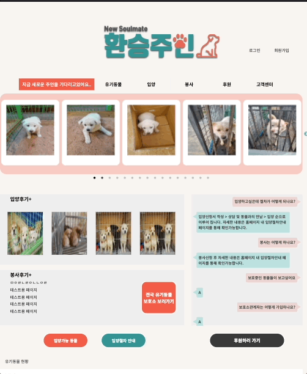
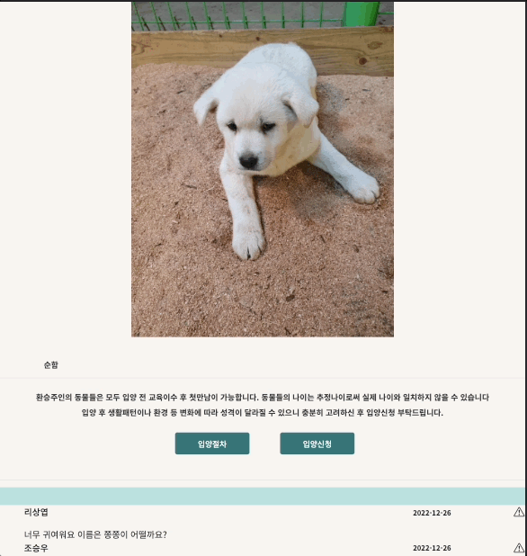
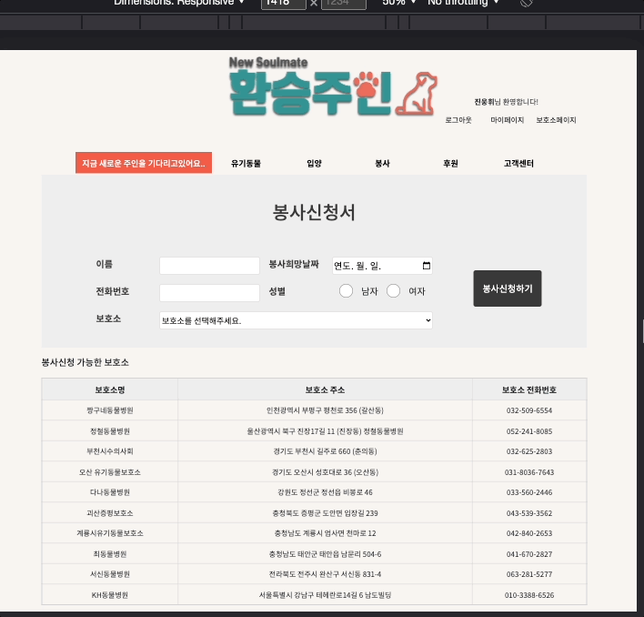
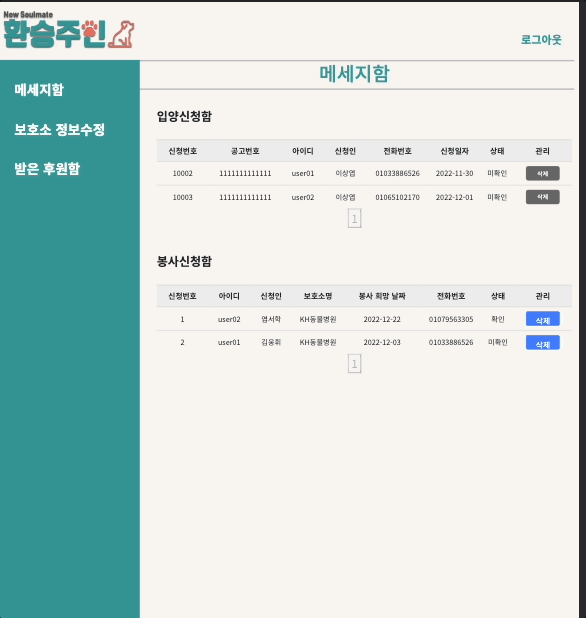
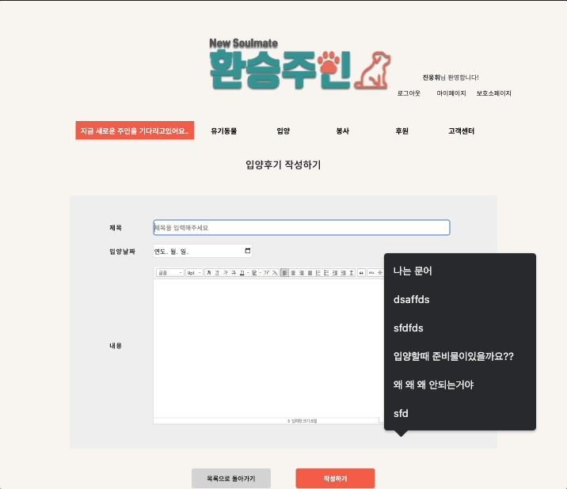

# 1. 유기동물입양플랫폼, 환승주인

<div>


</div>

<br/>

# 2. 환승주인을 만드는 사람

| <br />[진웅휘](https://github.com/woongwhee) | <br />[염서학](https://github.com/YEOMCODING) | <br />[장현정](https://github.com/HyunjeongJang) | <br />[김지호](https://github.com/KJeeu) | <br />[김도윤](https://github.com/kimdory) |
|:---------------------------------------------------------------------------------------------------------------:|:---------------------------------------------------------------------------------------------------------------:|:------------------------------------------------------------------------------------------------------------:|:------------------------------------------------------------------------------------------------------------------:|:-----------------------------------------------------------------------------------------------------------:|

<br/>

# 3. 환승주인를 만드는 기술

- **서버**: JAVA, Servlet,JDBC 
- **프론트엔드**:  JAVASCRIPT,JQUERY
- **데이터베이스**: ORACLE 11g
- **디자인 시스템**: [storybook]([bankidz.github.io/bankidz-client](https://bankidz.github.io/bankidz-client)), [Figma](https://www.figma.com/file/pF7iygMk2IXYGZxXockGY8/%5B1.0-ver%5D-%EB%94%94%EC%9E%90%EC%9D%B8?node-id=2%3A3), Theme-provider
- **버전 관리**:MAVEN,Git with GitHub
- **CI/CD**: Github-actions, Docker-compose
- **웹뷰 앱**: React Native with EXPO

<details>
<summary>디랙토리 구조</summary>
<div markdown="1">

  ```
  .
  ├──java
  │   ├──domain 
  │   │   ├──dao # 
  │   │   ├──dto # 외부api간 데이터 교환용폴더
  │   │   ├──vo # 
  │   │   └──type # enum
  │   └──web #비지니스 로직
  ├──resource
  │   ├──key # api키 관리용 xml폴더
  │   └──sql # sql문 저장용 xml폴더
  ├──webapp
  │   ├──js 자바스크립트 파일저장용폴더
  │   ├──img 이미지 리소스 저장용폴더
  │   ├──smarteditor2 스마트에디터 관련코드
  │   ├──css css파일 저장용폴더
  │   └──view# jsp파일 저장용폴더
      
file #첨부파일 저장용폴더 ($tomcathome/webapps/file)
       
  ```
</div>
</details>

<details>
<summary>Architecture</summary>
<div markdown="1">

  

뱅키즈의 개발 환경은 테스트 환경(dev)과 실 서비스 환경(main)이 분리되어 있습니다. 각 환경(branch)은 Github-actions, Dock-compose 기반 CI/CD 및 AWS EC2 인스턴스 기반 서버가 구축되어 있습니다. 또한, push 및 태깅 이벤트 감지를 통해 Docker-compose로 이미지 push가 trigger 됩니다. 실 서비스 환경의 이미지는 Github의 Relase 버저닝을 통해 관리됩니다.

</div>
</details>

<br/>

# 4. 주요 기능


## 4.1. 유기동물 조회

|                              메인페이지                               |                              유기동물  목록                               |                                상세조회                                 |
|:----------------------------------------------------------------:|:-------------------------------------------------------------------:|:-------------------------------------------------------------------:|
|                              메인페이지                               |                          유기동물 지역별 조회->상세조회                          |                           유기동물 상세조회,사진댓글                            |
|  |  |  |

<details>
<summary>자세히</summary>
<div markdown="1">

##### 메인페이지 
     메인페이지에서는 사용자에게 대부분의 기능에 간단하게 접근 할 수 있도록 설계 해놨습니다.
     유기동물 목록은 slick 라이브러리를 가저와서 구현했습니다.
##### 유기동물 검색 
     유기동물 검색은 비동기 형식으로 검색 할 수 있으며 페이징 형식을 
    무한 스크롤 형식으로 만들어놔 부드럽게 넘어갈 수 있습니다.
##### 유기동물 상세조회  
    유기동물 상세 조회로 해당 동물에 대한 자세한 정보를 조회 할 수 있으며
    유기동물에게 따뜻한 응원의 메세지와 보호소에 방문해서 찍은 사진을 댓글을 통해 남길 수 있다. 


</div>
</details>

<br/>
## 4.2. 입양 및 봉사 신청

|                             유기동물 입양신청                             |                               보호소 봉사신청                                |                                 신청 수락                                 |
|:-----------------------------------------------------------------:|:---------------------------------------------------------------------:|:---------------------------------------------------------------------:|
|                         유기동물 공고를 통한 입양신청                          |                             등록된 보호소별 봉사신청                             |                        (등록된 보호소관계자)신청자에게 문자보내기                        |
|  |  |  |

<details>
<summary>자세히</summary>
<div markdown="1">

##### 유기동물 입양신청
     등록된 유기동물에 대한 입양신청서를 작성 할 수 있다. 
    진정성 있는 장문의 입양신청서를 사용자에게 작성하게 강제한다.
##### 보호소 봉사신청
    사이트에 등록된 보호소에 봉사를 신청을 할 수 있는 페이지다.
##### 신청 수락
    사이트에 등록된 보호소 관계자의 경우 사이트에서 들어온 입양신청서와 봉사신청서를 간편하게 조회 할 수 있다. 
    확인 여부를 체크하여 확인되지 않은 신청서의 경우 사이트 관리자가 한번더 공지를 해줄수 있도록 했다.
    조회한 정보를 바탕으로 수락여부를 문자로 발송 할 수 있는 서비스도 제공한다.
    

</div>
</details>

<br/>
## 4.2. 후기게시판

|                                후기게시판 목록                                |                               후기 작성                                |                               후기 상세보기                               |
|:----------------------------------------------------------------------:|:------------------------------------------------------------------:|:-------------------------------------------------------------------:|
|  |  |  |

<details>
<summary>자세히</summary>
<div markdown="1">

##### 후기게시판 목록
     등록된 후기들을 비동기 처리된 무한스크롤로 10개 단위로 볼 수 있다.
##### 보호소 봉사신청
     게시판작성을 네이버 에디터를 통해 구현해 다체로운 게시글을 작성 할 수 있다.
     최대 5개의 첨부파일을 첨부 할 수 도록 설정했다.
##### 후기 상세보기
     후기 게시글을 상세 조회하는 페이지
     로그인된 사용자의 경우 댓글을 작성할수 있고 작성된 게시글과 댓글을 신고 할 수 있다.
     작성자의 경우 게시글을 수정 삭제 할 수 있다.
</div>
</details>

<br/>
# 5. 서비스 개발기

- **진웅휘** | [환승주인 개발기]()

<br/>
